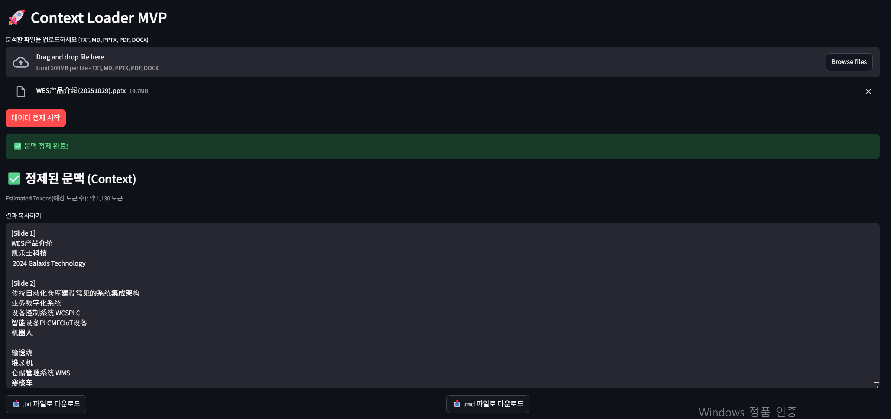

# 🚀 Context Loader MVP
> **Secure B2B Data Pre-processor (기업 보안 특화 AI 데이터 전처리 엔진)**

---

### 🖼️ Demo (실제 구동 화면)
 

*※ 물류 자동화 설비 제안서를 분석하여 AI 최적화 문맥을 로컬에서 추출하는 실제 화면입니다.*

---

## 🎯 Project Background (기획 의도)
많은 기업이 AI 도입을 희망하지만, **영업 기밀 및 기술 문서의 외부 유출** 우려로 인해 클라우드 기반 AI 활용에 제약을 겪고 있습니다. 

본 프로젝트는 모든 파싱 과정을 **100% Local(로컬)** 환경에서 수행하여 데이터 보안을 확보하고, AI의 이해도를 극대화하는 전처리를 수행합니다.

## ✨ Key Value (핵심 경쟁력)
* **Absolute Data Privacy**: 인터넷 연결 없는 로컬 자원 사용으로 기밀 유출 원천 차단.
* **AI-Native Formatting**: 표(Table)와 구조를 AI 최적화 **Markdown**으로 자동 변환.
* **Logistics Domain Ready**: 물류 자동화 설비(WES, WMS 등) 문서 처리에 특화.

## 🛠️ Tech Stack (기술 스택)
* **Frontend**: `Streamlit` (Python-based Web UI)
* **Parsing Engine**: `python-pptx`, `PyPDF2`, `python-docx`

## 📂 Project Structure (폴더 구조)
```text
├── engine/          # 문서 파싱 및 마크다운 변환 핵심 로직
├── ui/              # Streamlit 기반 웹 인터페이스 구성 요소
├── main.py          # 애플리케이션 시작점
└── requirements.txt  # 의존성 패키지 목록
```

---

## 🗺️ Future Roadmap (향후 로드맵)

* **Local OCR**: 이미지 내 수치 인식을 위한 로컬 OCR(Optical Character Recognition, 광학 문자 인식) 엔진 탑재
* **On-premise sLLM**: 로컬 언어 모델 연동을 통한 보안 문서 요약 기능
* **Enterprise Pack**: 윈도우용 실행 파일(.exe) 배포 및 Java/Spring 연동
